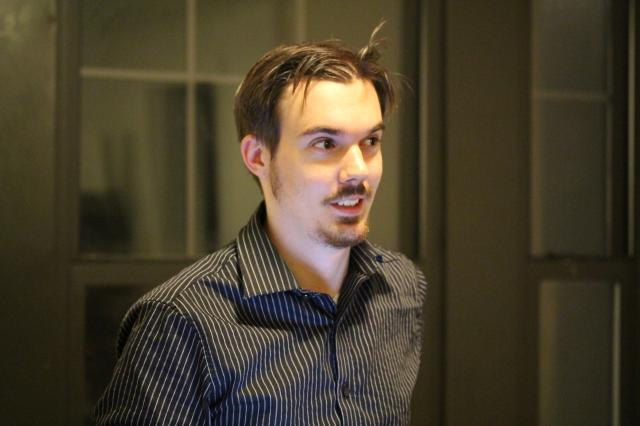

Greetings! My name is John Pellman. I am a system administrator / cognitive science geek in Manhattan. My interests lie at the intersection of science and IT, with a particular focus on how technology can facilitate progress in our understanding of the world and improve the human race’s quality of life.

In our contemporary, post-industrial age a pervasive fear has arisen that, with increased automation, technology will replace the need for humanity. I believe that technology cannot replace humanity, and that this perspective that humans can be replaced should be discarded for a healthier view in which society perceives technology as a tool to accompany cognition rather than a stand-in for expertise and wisdom. Technology (as a tool) should be used to enable and ennoble humanity, augmenting our natural abilities just as previous tools such as hammers, quills, glasses, and printing presses have augmented us in the past. In my role as a technical professional, I would like to serve to help society leverage technology to make the world a better place. In brief, I like to bring a humanistic perspective to my work.

Photo Credit: [Joaquin Ruales](http://joaquin.rual.es/)

Photo credits for the banner images on this site may be found [here](photocredits.html).

